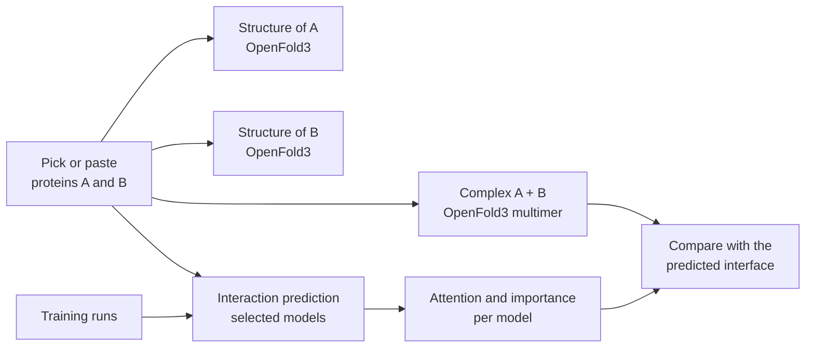

# ppi-language-models


From-scratch PyTorch implementations of four sequence architectures — a **bidirectional Mamba (SSM)**, a **bidirectional (BERT-style) Transformer encoder**, a **bidirectional LSTM** and a **dilated CNN** — used as protein language models for **protein–protein interaction (PPI) prediction**, on a leakage-free benchmark.

They are compared with a large **pre-trained protein language model (ESM-2), kept frozen**, validated against **3D complexes predicted by OpenFold3**, and will eventually be brought together in a **local web platform** to train the models, predict interactions and compare what each model looks at.

> **Status: work in progress.** Results will be added below as they come in.
>
> - [x] Data pipeline: tokenizer, pair datasets, cropping, augmentation, MLM masking, loaders + tests
> - [ ] Models: Transformer → dilated CNN → BiLSTM → BiMamba
> - [ ] Training loops (MLM, classification) and evaluation
> - [ ] Experiments A and B (from scratch)
> - [ ] Experiment C: frozen pre-trained encoder (ESM-2) + trained heads
> - [ ] Structural validation with OpenFold3 complexes
> - [ ] Analyses and visualizations, including interpretability for the four architectures
> - [ ] Local PPI platform (web app), see [Next step](#next-step-a-local-ppi-platform)

---

## Research question

**Does masked language modeling (MLM) pre-training help a small protein language model predict protein–protein interactions, compared with training directly on the interaction labels — and does the answer depend on the architecture?**

Two complementary questions follow from it:

- **How far are these small from-scratch models from a large pre-trained model?** A frozen ESM-2 encoder with a trained head (experiment C) gives the reference ceiling for this code base.
- **Do the models look at the right place?** Interaction scores, residue importance and attention are compared with the interface of the complex predicted by OpenFold3.

Everything is kept at "toy" scale on purpose: small models (a few million parameters), a single benchmark, and every architecture written by hand, so that the comparison isolates the effect of the architecture and of the training strategy rather than of scale.

---

## Data

### Gold-standard human PPI dataset (Bernett et al.)

Sequence-based PPI prediction is known to suffer from data leakage: many published models reach 95–99 % accuracy only because test proteins (or close homologs) also appear in training. On a leakage-free split, their performance drops close to random.

This project uses the **gold-standard dataset** of Bernett, Blumenthal & List (2024), built to avoid this:

- the human proteome is split so that **no protein is shared** between train, validation and test;
- sequence similarity between splits is minimized (KaHIP partitioning on length-normalized bitscores);
- redundancy is reduced inside each split (CD-HIT, < 40 % pairwise identity);
- each split is balanced, 50 % positive / 50 % negative pairs.

| Split | Files | Pairs | Positives | Negatives |
|---|---|---|---|---|
| Train | `Intra1_pos_rr.txt`, `Intra1_neg_rr.txt` | 163,192 | 81,596 | 81,596 |
| Validation | `Intra0_pos_rr.txt`, `Intra0_neg_rr.txt` | 59,260 | 29,630 | 29,630 |
| Test | `Intra2_pos_rr.txt`, `Intra2_neg_rr.txt` | 52,048 | 26,024 | 26,024 |

Sequences come from `human_swissprot_oneliner.fasta` (20,386 human Swiss-Prot proteins).

**Protein lengths** (whole file): median 415 residues, mean 558, 90th percentile 1,076, maximum 34,350. Most human proteins are longer than a toy model's context, which drives the cropping strategy described below.

For reference, even large pre-trained embeddings (ESM-2) plateau at an accuracy of about **0.65** on this benchmark. Small models trained from scratch are expected to land between chance (0.5) and that ceiling.

### Download

1. Download the dataset from figshare: <https://doi.org/10.6084/m9.figshare.21591618> ("Download all", ~15 MB).
2. Extract it into `data/gold_standard_data/`:

```
data/gold_standard_data/
├── human_swissprot_oneliner.fasta
├── Intra0_pos_rr.txt   Intra0_neg_rr.txt
├── Intra1_pos_rr.txt   Intra1_neg_rr.txt
└── Intra2_pos_rr.txt   Intra2_neg_rr.txt
```

The `data/` folder is git-ignored: the data is not redistributed in this repository.

---

## Installation

```bash
git clone https://github.com/Felix-Bos/ppi-language-models.git
cd ppi-language-models
pip install -e ".[dev]"
```

The project is installed as an editable package (`ppi_lm`), so modules can be imported from anywhere (scripts, tests, notebooks):

```python
from ppi_lm.data_scripts.gold_standard_dataset import GoldStandardDataset
```

---

## Repository structure

```
ppi-language-models/
├── .github/workflows/ci.yml          # lint (ruff + black) + tests (pytest) on every push
├── .pre-commit-config.yaml           # ruff (lint + fix, format) + black on every commit
├── data/                             # datasets (not versioned)
├── docs/PLATFORM.md                  # roadmap: experiment C, OpenFold3 validation, web platform
├── notebooks/                        # exploration and visualizations
├── src/ppi_lm/
│   ├── data_scripts/
│   │   ├── tokenizer.py              # character-level protein tokenizer
│   │   ├── gold_standard_dataset.py  # file loading, PairDataset, DataLoaders
│   │   └── collators.py              # padding, MLM masking, classification batches
│   └── models/                       # Transformer, CNN, BiLSTM, BiMamba (in progress)
├── tests/                            # unit tests, run on a synthetic mini-dataset
├── pyproject.toml
└── README.md
```

---

## Data pipeline

### 1. Tokenizer

Character-level: one amino acid = one token. The vocabulary is fixed (no training involved) and shared by every stage, so pre-trained weights can be reused without changing the embedding size.

| Tokens | IDs |
|---|---|
| `<PAD>` `<MASK>` `<CLS>` `<SEP>` `<EOS>` | 0–4 |
| 20 standard amino acids | 5–24 |
| `X` (unknown / ambiguous) | 25 |

Rare residues (`U`, `O`, `B`, `Z`) and any unexpected character are mapped to `X`, so that no residue is ever silently dropped. `<PAD>` is 0 so that `nn.Embedding(padding_idx=0)` can be used.

### 2. Pair input format

Both proteins are concatenated into a single sequence, with segment ids telling the model which protein each token belongs to:

```
tokens      <CLS>  A₁ A₂ … Aₙ  <SEP>  B₁ B₂ … Bₘ  <EOS>
segments      0    0  0 …  0     0     1  1 …  1     1
```

**Cropping.** Each protein is limited to `max_protein_length` residues. During training, a random contiguous window is taken (a form of data augmentation, like a random crop on images); during evaluation, the window always starts at the beginning, so that metrics are deterministic.

**Pair-order augmentation.** The input is not symmetric in A and B (positions and segment ids differ, and reading `A,B` backwards is not `B,A`), so a bidirectional model is not automatically order-invariant. The option `augmentation_percent` adds a fraction of the training pairs again in the reversed order `(B, A)`, with a fixed seed for reproducibility. Validation and test are never augmented.

### 3. Collators (from a list of examples to a batch)

- **Padding**: sequences are right-padded to the longest one in the batch, and an `attention_mask` (True on real tokens) is returned so that every architecture can ignore padding — in attention, in mean pooling, and when reversing sequences for the backward pass of bidirectional recurrent models.
- **Classification collator**: returns padded tokens, segments, attention mask and one float label per pair.
- **MLM collator**: masking is recomputed for every batch (dynamic masking):
  - about 15 % of residues are selected, as short **spans** (1–3 residues), which forces the model to use longer-range context — including the partner protein — rather than immediate neighbors;
  - special tokens and padding are never selected;
  - BERT's **80/10/10** rule: 80 % → `<MASK>`, 10 % → random standard amino acid, 10 % → unchanged;
  - labels hold the original token on selected positions and `-100` elsewhere (ignored by `CrossEntropyLoss`).

### 4. Loaders

```python
data = GoldStandardDataset("data/gold_standard_data", max_protein_length=512, batch_size=32)

data.mlm_loader("train")  # positive pairs only, with masking   → pair pre-training
data.classif_loader("train")  # all pairs, with 0/1 labels          → classification
data.classif_loader("val")  # model selection, early stopping
data.classif_loader("test")  # final evaluation only
```

---

## Models

All four encoders are **bidirectional**: each residue is represented using context on both sides, as required by masked language modeling (a causal, left-to-right model could not use the residues after a masked position). They share the same interface — `(input_ids, segment_ids, attention_mask) → one vector per token` — and are sized to a comparable number of parameters.

| Model | Mixing mechanism | Cost in sequence length | Notes |
|---|---|---|---|
| Transformer (BERT-style encoder) | bidirectional self-attention, no causal mask | O(L²) | every token attends to the whole pair, left and right |
| Dilated CNN | stacked dilated convolutions | O(L) | receptive field must cover both proteins |
| BiLSTM | recurrence, both directions | O(L), sequential | backward pass must skip padding |
| BiMamba | selective state-space model, both directions | O(L) | selective scan implemented by hand |

**Heads**
- **MLM head**: linear layer from token vectors to the 26-token vocabulary.
- **Classification head**: mean pooling over real tokens (masked), then a small MLP → one logit. Mean pooling is used rather than the `<CLS>` vector because a `<CLS>` token in position 0 does not see the whole pair equally well in every architecture (e.g. a CNN only sees its receptive field), which would bias the comparison towards the Transformer.

The Transformer is implemented first: it is the best documented of the four and validates the whole pipeline before the others are added.

---

## Experiments

Three strategies are compared. A and B train each of the four architectures from scratch; everything except the pre-training is identical between them: input format, encoder, classification head, training / validation / test data and metric. C replaces the from-scratch encoder by a large frozen pre-trained one, to measure the gap with pre-training at scale.

### Experiment A — direct training

1. **Classification**: encoder + MLP head trained together from random initialization, with binary cross-entropy only.
   - Train: `Intra1`, positives + negatives
   - Validation: `Intra0` (hyper-parameters, early stopping)
2. **Test** on `Intra2`.

### Experiment B — masked pre-training, then classification

1. **Single-protein MLM** — input `<CLS> sequence <EOS>`, on the human proteins of the dataset (loader not implemented yet).
2. **Pair MLM** — input `<CLS> A <SEP> B <EOS>`, masking inside both proteins.
   - Train: **positive** pairs of `Intra1` only (81,596) — in a negative pair the partner carries no information about the masked residues, which would dilute the signal.
   - Validation: positive pairs of `Intra0` (perplexity).
3. **Classification** — the pre-trained encoder gets the same MLP head as in A, trained on `Intra1` (positives + negatives), in two variants:
   - **frozen encoder**: only the head is trained → measures the quality of the learned representations;
   - **fine-tuned encoder**: encoder and head trained together, with a lower learning rate for the encoder.
4. **Test** on `Intra2`.

### Experiment C — frozen pre-trained encoder (ESM-2)

A large protein language model, pre-trained on millions of sequences, is used **frozen**: only a prediction head is trained on the gold-standard dataset. It answers the question: how far are the from-scratch models from what pre-training at scale gives for free?

| Model | Parameters | Embedding size | On a laptop |
|---|---:|---:|---|
| `facebook/esm2_t6_8M_UR50D` | 8 M | 320 | instant, for prototyping |
| `facebook/esm2_t12_35M_UR50D` | 35 M | 480 | very fast |
| `facebook/esm2_t30_150M_UR50D` | 150 M | 640 | **recommended trade-off** |
| `facebook/esm2_t33_650M_UR50D` | 650 M | 1280 | feasible, slower |

1. **Embed once.** The frozen encoder runs a single time over every protein of the dataset (20,386 sequences); one vector per residue is stored in float16, keyed by UniProt id. Training then only costs the head, which keeps it feasible on a laptop.
2. **Crop consistently**, with the same `max_protein_length` policy as A and B (ESM-2 itself is limited to 1,022 residues).
3. **Train heads on the stored embeddings**, with the same splits (`Intra1` / `Intra0` / `Intra2`) and the same metric (test AUROC):

| Head | Input | Why |
|---|---|---|
| Pooled MLP | mean-pooled A and B → `[a, b, a·b, \|a − b\|]` → MLP | Simplest baseline, **symmetric by construction**: f(A, B) = f(B, A) |
| The four architectures | per-residue ESM-2 embeddings of `A <SEP> B` instead of token embeddings | Same comparison as A and B, with a much richer input |
| Cross-attention | residues of A attend to residues of B (and the reverse), then pooling | Produces an explicit **A × B interaction map**, the most interpretable option |

If a frozen encoder plateaus, the next step is light adaptation rather than full fine-tuning: low-rank adapters (LoRA) on a small ESM-2 train a few hundred thousand parameters and remain feasible on a laptop. The literature reports that PLM-based models plateau at an accuracy of about 0.65 on this benchmark (Reim et al., 2025); experiment C gives that ceiling for this code base.

### Leakage safeguards

- Pair MLM and classification only ever use **training** pairs. Validation is used for model selection only; the test set is evaluated once, at the very end.
- Step B.1 sees single sequences only (no interaction information), which is standard practice for protein language models (ESM does the same). To be fully conservative, it can be restricted to training proteins; both variants can be compared.
- In C, ESM-2 was pre-trained on UniRef, which contains the test proteins as single sequences, but never saw interaction labels: like B.1, it only learns from sequences.
- The absence of protein overlap between splits is checked by a unit test (on the synthetic mini-dataset in CI; it can be run on the real data locally).

### Fairness of the comparison

B receives more total compute than A (two extra pre-training stages). To make sure a gain comes from what B learns rather than from longer training, A is given at least as many classification epochs as B, and the total training time of each run is reported.

### Results (to be filled)

**Test AUROC**

| Architecture | A (direct) | B, frozen encoder | B, fine-tuned |
|---|---|---|---|
| Transformer | | | |
| Dilated CNN | | | |
| BiLSTM | | | |
| BiMamba | | | |

**Experiment C — frozen ESM-2 (test)**

| Head | Test AUROC | Test accuracy |
|---|---|---|
| Pooled MLP | | |
| Transformer on ESM-2 embeddings | | |
| Dilated CNN on ESM-2 embeddings | | |
| BiLSTM on ESM-2 embeddings | | |
| BiMamba on ESM-2 embeddings | | |
| Cross-attention | | |

**Pair MLM (validation)**

| Architecture | Perplexity with true partner | Perplexity with random partner |
|---|---|---|
| Transformer | | |
| Dilated CNN | | |
| BiLSTM | | |
| BiMamba | | |

Reference points for the MLM loss: guessing uniformly among 20 amino acids gives ln(20) ≈ 3.0; predicting amino-acid frequencies alone gives about 2.9. A model has to go clearly below that to be using context.

---

## Structural validation with OpenFold3

Sequence models predict *whether* two proteins interact, not *how*. [OpenFold3](https://github.com/aqlaboratory/openfold-3), an open reproduction of AlphaFold3 run locally through [OpenFold3-MLX](https://github.com/latent-spacecraft/openfold-3-mlx), predicts the 3D structure of a **complex** from the two sequences. This gives a structural reference to check the models against. The single-protein side (structure, per-residue confidence, attention analysis) already exists in [OpenFold Studio](https://github.com/Felix-Bos/openfold-studio).

Outputs used from a two-chain prediction:

- **ipTM** (interface predicted TM-score, 0–1): confidence in the relative placement of the two chains. Above about 0.8 the interface is usually reliable; below about 0.6 it is likely wrong.
- **Inter-chain PDE / PAE**: the A × B block of the predicted error matrix, i.e. how sure the model is about each part of the interface.
- **Interface contacts**: residue pairs (i in A, j in B) whose alpha carbons are closer than 8 Å.

Analyses:

1. **ipTM vs. PPI score**: correlation between each model's predicted probability and ipTM, on positive and negative pairs.
2. **Attention and importance vs. interface**: share of the A → B attention (Transformer, cross-attention head) and of the residue importance (all models) that falls on predicted interface contacts, compared with random pairs (enrichment).
3. **Case studies**: a few test pairs shown side by side, with the model predictions, the predicted complex, the interface and the attention maps.

Caveats: a predicted complex is **not proof of interaction** (OpenFold3 builds a complex for any two proteins; only a low ipTM betrays a wrong one), memory grows quickly with the combined length, and each complex takes minutes. This is an analysis on tens of short test pairs (e.g. A + B ≤ 400 residues), not on the whole test set.

---

## Planned analyses and visualizations

- **Does the model use the partner?** MLM perplexity on protein A with its true partner vs. with a random protein as B. A lower perplexity with the true partner means the model exploits interaction information.
- **Amino-acid embeddings.** PCA of the learned embedding matrix, colored by physico-chemical class (hydrophobic, charged, polar, aromatic).
- **MLM confusion matrix vs. BLOSUM62.** Which amino acid is predicted instead of the true one, compared with evolutionary substitution rates.
- **Latent space.** UMAP of mean-pooled protein embeddings (colored by length, family, subcellular location) and of pair embeddings (colored by label), for A vs. B.
- **Attention maps** (Transformer, cross-attention head): which regions of B each residue of A attends to, with the metrics used in [OpenFold Studio](https://github.com/Felix-Bos/openfold-studio): focus (1 − normalized entropy), local vs. long-range mass, **cross-protein mass** (share of A's attention that goes to B, per layer and head, for positive vs. negative pairs) and **attention sinks** (`<CLS>`, `<SEP>` or a few residues absorbing attention, to exclude before interpretation).
- **Residue importance for all four architectures.** Only the Transformer has attention maps, so every model also gets an architecture-agnostic view: **integrated gradients** on the inputs with respect to the interaction logit (via Captum), one score per residue of A and B. Do the four models look at the same regions, and at the predicted interface?
- **Known shortcuts.** Performance as a function of protein length and of node degree (number of partners in training), since previous work showed that PPI models often exploit degree rather than sequence.
- **Order symmetry.** Gap between the predictions for `(A, B)` and `(B, A)`, with and without pair-order augmentation, and test-time averaging of both orders.
- **Effect of cropping.** Test AUROC on the full test set vs. on pairs that fit entirely in the context window.
- **Scaling with length.** Training time and memory per architecture as `max_protein_length` grows (e.g. 256 → 512 → 1000), where linear-time models (CNN, LSTM, Mamba) are expected to scale better than attention.
- Standard curves: training / validation losses, ROC curves.

---

## Next step: a local PPI platform

Once the experiments are in place, everything will be brought together in **one local web app**, following the design and architecture of [OpenFold Studio](https://github.com/Felix-Bos/openfold-studio): train the models, predict interactions, look at the proteins and their complex in 3D, and compare what each model pays attention to.



| Page | Content |
|---|---|
| **Train** | Launch a run: architecture, strategy (A direct, B pre-training, C frozen ESM-2), hyper-parameters; live loss and validation AUROC curves |
| **Run / Leaderboard** | One run in detail (curves, ROC, confusion matrix, training time), and all runs compared, with the results tables above filled automatically |
| **Protein** | OpenFold3 structure of one protein, coloured by confidence, with its per-residue confidence analysis |
| **Pair explorer** | Both structures, the predicted complex (ipTM, interface), every model's interaction probability, and side-by-side residue importance and attention maps, with their overlap with the interface |
| **Model analyses** | The figures listed above, generated from finished runs |
| **Dataset / Guide** | Split statistics and leakage checks; how each architecture and metric works |

Design principles carried over from OpenFold Studio: layered backend (thin views, services, pure and tested domain logic, adapters for external tools), the `ppi_lm` package kept independent of the platform, heavy work (training, embedding, folding) in background jobs with OpenFold3 in its own Python environment, one directory per run / structure / complex, live metrics streamed to the browser, and everything sized for a laptop (Apple Silicon, `mps`, one GPU job at a time).

The full roadmap, with milestones, is in [docs/PLATFORM.md](docs/PLATFORM.md).

---

## Development

```bash
pytest -v          # unit tests (synthetic mini-dataset, no real data needed)
ruff check --fix . # lint (+ auto-fix)
ruff format .      # format
black .            # format (notebooks excluded)
```

Tests cover the tokenizer, file loading, pair construction, cropping, augmentation, padding, MLM masking (never on special tokens or padding, ~15 % selection, spans, 80/10/10 rule, dynamic masking) and the DataLoaders.

### Code quality rules

Configured in `pyproject.toml` (line length 100, Python 3.10), for both ruff and black. The ruff lint rules are:

| Rules | Checks |
|---|---|
| `E`, `F` | style errors, undefined names, unused imports / variables |
| `I` | import sorting |
| `UP` | modern Python syntax |
| `B` | common bugs (bugbear) |
| `C90` | cyclomatic complexity (McCabe), at most **10** per function |
| `PLR09` | function size: too many branches, statements, returns or arguments (at most **8** arguments, since dataset / model constructors take many hyper-parameters) |

Tool versions are pinned (`ruff==0.16.8`, `black==26.5.1`) in `pyproject.toml`, in the pre-commit config and in CI, so that local checks and CI always agree.

### Pre-commit

```bash
pre-commit install          # once per clone: runs the hooks on every git commit
pre-commit run --all-files  # run them manually on the whole repository
```

On each commit, the hooks in `.pre-commit-config.yaml` run on the staged files: `ruff check --fix` (auto-fixes what it can), `ruff format`, then `black` (Python files only, notebooks are left untouched). If a hook modifies a file, the commit is stopped: `git add` the changes and commit again.

### Continuous integration

The GitHub Actions workflow (`.github/workflows/ci.yml`) runs on every push to `main` and on pull requests, with two jobs:

- **Lint**: `ruff check .`, `ruff format --check .` and `black --check .` (check only, nothing is modified);
- **Tests**: `pytest -v` with CPU PyTorch.

---

## References

- Bernett, J., Blumenthal, D. B., & List, M. (2024). *Cracking the black box of deep sequence-based protein–protein interaction prediction.* Briefings in Bioinformatics, 25(2), bbae076.
- Bernett, J. (2022). *PPI prediction from sequence, gold standard dataset.* figshare. <https://doi.org/10.6084/m9.figshare.21591618>
- Reim, T., Hartebrodt, A., Blumenthal, D. B., Bernett, J., & List, M. (2025). *Deep learning models for unbiased sequence-based PPI prediction plateau at an accuracy of 0.65.* Bioinformatics.
- Liu, D., et al. (2025). *PLM-interact: extending protein language models to predict protein–protein interactions.* Nature Communications.
- Abramson, J., et al. (2024). *Accurate structure prediction of biomolecular interactions with AlphaFold 3.* Nature.
- Sundararajan, M., Taly, A., & Yan, Q. (2017). *Axiomatic attribution for deep networks (integrated gradients).* ICML.
- Devlin, J., et al. (2019). *BERT: Pre-training of deep bidirectional transformers for language understanding.* NAACL.
- Gu, A., & Dao, T. (2023). *Mamba: Linear-time sequence modeling with selective state spaces.*
- Lin, Z., et al. (2023). *Evolutionary-scale prediction of atomic-level protein structure with a language model (ESM-2).* Science.