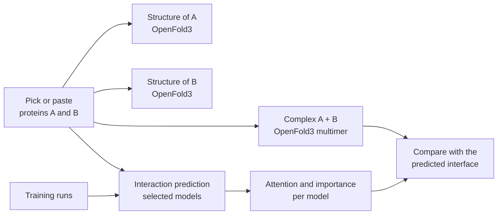

# Roadmap: from experiments to a PPI platform

This document describes where the project goes after experiments A and B (see the [README](../README.md)): a pre-trained protein language model baseline, structural validation with OpenFold3, interpretability analyses shared by the four architectures, and then the next step, a local web platform that brings training, structure prediction, interaction prediction and model comparison together.

Everything stays at toy scale and runs on a laptop (Apple Silicon, PyTorch `mps` backend).

---

## 1. Experiment C: frozen pre-trained encoder

Experiments A and B train small encoders from scratch. Experiment C adds the reference point: a large pre-trained protein language model (PLM), **frozen**, with only a prediction head trained on the gold-standard dataset. It answers a complementary question: how far are the from-scratch models from what pre-training on millions of proteins gives for free?

### Encoder

[ESM-2](https://github.com/facebookresearch/esm) weights are available on Hugging Face and load with `transformers`:

| Model | Parameters | Embedding size | On a laptop |
|---|---:|---:|---|
| `facebook/esm2_t6_8M_UR50D` | 8 M | 320 | instant, for prototyping |
| `facebook/esm2_t12_35M_UR50D` | 35 M | 480 | very fast |
| `facebook/esm2_t30_150M_UR50D` | 150 M | 640 | **recommended trade-off** |
| `facebook/esm2_t33_650M_UR50D` | 650 M | 1280 | feasible, slower |

### Method

1. **Embed once.** Run the frozen encoder once over every protein of the dataset (20,386 sequences) and store one vector per residue, in float16, keyed by UniProt id. The encoder never runs again during training, so each epoch only costs the head.
2. **Crop consistently.** Apply the same `max_protein_length` policy as the other experiments (ESM-2 itself is limited to 1,022 residues).
3. **Train heads on the stored embeddings**, with the same splits (`Intra1` / `Intra0` / `Intra2`) and the same metric (test AUROC).

### Heads to compare

| Head | Input | Why |
|---|---|---|
| Pooled MLP | mean-pooled A and B → `[a, b, a·b, \|a − b\|]` → MLP | Simplest baseline, **symmetric by construction**: f(A, B) = f(B, A) |
| The four architectures | per-residue embeddings of `A <SEP> B` instead of token embeddings | Same comparison as A and B, with a much richer input |
| Cross-attention | residues of A attend to residues of B (and the reverse), then pooling | Produces an explicit **A × B interaction map**, the most interpretable option |

If a frozen encoder plateaus, the next step is **light adaptation** rather than full fine-tuning: low-rank adapters (LoRA) on the attention layers of a small ESM-2 (35M or 150M) train a few hundred thousand parameters and remain feasible on a laptop.

Expected range: the literature reports that PLM-based models plateau at an accuracy of about 0.65 on this benchmark (Reim et al., 2025). Experiment C gives that ceiling for this code base, so the from-scratch results can be read against it.

### Results (to be filled)

| Head | Test AUROC | Test accuracy |
|---|---|---|
| Pooled MLP | | |
| Transformer on ESM-2 embeddings | | |
| Dilated CNN on ESM-2 embeddings | | |
| BiLSTM on ESM-2 embeddings | | |
| BiMamba on ESM-2 embeddings | | |
| Cross-attention | | |

---

## 2. Structural validation with OpenFold3

Sequence models predict *whether* two proteins interact, not *how*. [OpenFold3](https://github.com/aqlaboratory/openfold-3) (an open reproduction of AlphaFold3, run locally through [OpenFold3-MLX](https://github.com/latent-spacecraft/openfold-3-mlx)) can predict the 3D structure of a **complex** from the two sequences, which gives a structural reference to compare the models against.

### Predicting a complex

A query with two protein chains:

```json
{
  "queries": {
    "P12345_Q67890": {
      "chains": [
        { "molecule_type": "protein", "chain_ids": ["A"], "sequence": "MKT..." },
        { "molecule_type": "protein", "chain_ids": ["B"], "sequence": "GSH..." }
      ]
    }
  }
}
```

Useful outputs:

- **ipTM** (interface predicted TM-score, 0–1): confidence in the relative placement of the two chains. Above about 0.8 the interface is usually reliable; below about 0.6 it is likely wrong.
- **Inter-chain PDE / PAE**: the A × B block of the predicted error matrix, i.e. how sure the model is about each part of the interface.
- **Interface contacts**: residue pairs (i in A, j in B) whose alpha carbons are closer than 8 Å in the predicted complex.

### Analyses

1. **ipTM vs. PPI score.** Do the sequence models give higher scores to pairs that OpenFold3 docks confidently? Correlation between each model's predicted probability and ipTM, on positives and negatives.
2. **Attention vs. interface.** For the Transformer (and the cross-attention head), the share of A → B attention that falls on predicted interface contacts, compared with what random pairs would give (enrichment).
3. **Case studies.** A few test pairs shown side by side: sequence-model prediction, predicted complex, interface contacts and attention map.

### Caveats

- A predicted complex is **not proof of interaction**: OpenFold3 will build a complex for any two proteins, and only a low ipTM betrays a wrong one.
- Memory grows quickly with total length (roughly between L² and L³). Restrict this analysis to a subset of test pairs with a small combined length (e.g. A + B ≤ 400 residues), which the human proteome makes rare: median length is 415 residues.
- Heteromers need paired multiple sequence alignments from the ColabFold server, and each complex takes minutes: this is an analysis on tens of pairs, not on the whole test set.

---

## 3. Interpretability for all four architectures

Only the Transformer has attention maps. To compare the four encoders on equal footing, every analysis should also have an **architecture-agnostic** version.

### Residue importance (all architectures)

- **Integrated gradients** (Sundararajan et al., 2017) on the token or embedding inputs, with respect to the interaction logit, give one importance score per residue of A and B for any differentiable model. [Captum](https://captum.ai/) implements it for PyTorch.
- Questions: do the four models look at the same regions? Do important residues overlap with predicted interface contacts (section 2)?

### Attention metrics (Transformer, cross-attention head)

These metrics come from [OpenFold Studio](https://github.com/Felix-Bos/openfold-studio), where they are computed per layer for OpenFold3:

| Metric | Definition | What it tells |
|---|---|---|
| Focus | 1 − mean row entropy / log(N) | Concentrated vs. diffuse attention |
| Local / long-range mass | share of weight with \|i − j\| ≤ 3 / ≥ 24 | Sequence neighbours vs. distant residues |
| **Cross-protein mass** | share of the attention of A's tokens that goes to B's tokens (and the reverse) | Whether the model actually uses the partner |
| Attention sinks | tokens receiving more than 5× their uniform share | `<CLS>`, `<SEP>` or a few residues absorbing attention, to exclude before interpretation |
| Contact precision | share of the strongest A–B links that are predicted interface contacts | Link with the 3D structure (section 2) |

The **cross-protein mass** is the attention counterpart of the "does the model use the partner?" analysis already planned with MLM perplexity: it can be tracked per layer, per head, and between the positive and negative pairs.

---

## 4. Next step: the PPI platform

Once the experiments are in place, the next step is to bring everything together in **one clean local web app**: train the models, predict interactions, look at the proteins and their complex in 3D, and compare what each model pays attention to. It follows the design and architecture of [OpenFold Studio](https://github.com/Felix-Bos/openfold-studio), which already does this for single-protein structure prediction.

### What the platform does



1. **Single proteins.** For each protein, OpenFold3 predicts its structure. The page shows the 3D model coloured by confidence (pLDDT), the per-residue confidence curve, low-confidence regions and the predicted distance error map, exactly as in OpenFold Studio.
2. **Complex.** OpenFold3 predicts the structure of A and B together. The page shows the complex with both chains, the interface residues highlighted, the interface confidence (ipTM) and the inter-chain error map.
3. **Interaction prediction.** The user picks one or several trained models (Transformer, dilated CNN, BiLSTM, BiMamba, and the ESM-2 heads of experiment C). Each model gives its interaction probability, and the page shows whether they agree, next to the ipTM of the complex.
4. **Model comparison on the pair.** For the same pair, side by side:
   - residue importance of every model (integrated gradients), drawn on the sequences and on the 3D complex;
   - attention maps for the models that have them (Transformer, cross-attention head), with the A → B block, cross-protein mass per layer and attention sinks;
   - overlap of each model's important residues with the predicted interface: which model looks at the right place?
5. **Training results.** Every training run and its results, browsable from the site instead of scattered notebooks.

### Pages

| Page | Content |
|---|---|
| **Home** | Headline numbers (runs, best test AUROC per architecture), quick pair prediction, recent activity |
| **Dataset** | Split sizes, length and degree distributions, the check that no protein is shared between splits |
| **Train** | Launch a run: architecture, strategy (A direct, B pre-training, C frozen ESM-2), hyper-parameters, `max_protein_length`; live progress |
| **Run** | One run: live loss and validation AUROC curves, learning rate, ROC and precision-recall curves on the test set, confusion matrix, training time, parameter count, config and logs |
| **Leaderboard** | All runs compared: the results tables of experiments A, B and C filled automatically, filters by architecture and strategy, overlaid ROC curves |
| **Protein** | One protein: OpenFold3 structure and confidence analysis |
| **Pair explorer** | Two proteins: both structures, the complex, every model's prediction, importance and attention comparison, interface overlap |
| **Model analyses** | The figures planned in the README, generated from a finished run: embedding PCA, MLM confusion vs. BLOSUM62, UMAP of protein and pair embeddings, performance vs. length and node degree, (A, B) vs. (B, A) symmetry, scaling with length |
| **Guide** | How each architecture and each metric works, as the "How the model works" page of OpenFold Studio |

### Architecture

```text
platform/
├── backend/                  Django
│   ├── config/
│   └── ppi_platform/
│       ├── domain/           pure logic: metrics, attention statistics, interface overlap
│       ├── adapters/         ppi_lm (models, data), OpenFold3 (subprocess), embeddings cache
│       ├── services/         use cases: train, predict, fold, compare
│       ├── tasks/            job queue: training, embedding, folding (one GPU job at a time)
│       ├── views/            HTML pages and JSON API
│       └── tests/
├── frontend/
│   ├── templates/
│   └── static/               CSS design system, JS modules (charts, heatmaps, 3D viewer)
└── var/
    ├── runs/<run_id>/        config.json, metrics.jsonl, checkpoints, logs, predictions
    ├── structures/<id>/      OpenFold3 outputs for single proteins and complexes
    └── embeddings/           ESM-2 vectors per protein (float16)
```

Principles carried over from OpenFold Studio:

- **Layers**: views are thin, services hold the business rules, domain functions are pure and unit-tested, adapters isolate external tools.
- **The `ppi_lm` package stays independent**: the platform imports it, never the other way round, so experiments remain runnable from scripts and notebooks.
- **Heavy work outside the web process**: training, embedding and folding run as background jobs; OpenFold3 runs as a subprocess in its own Python environment. Training runs last longer than a prediction, so a small persistent job queue replaces plain threads, and jobs survive a server restart.
- **One source of truth for paths**: every run, structure or complex gets a directory named after its id; nothing machine-specific is stored in the database.
- **Live metrics**: the training loop appends one JSON line per step or epoch to `metrics.jsonl`; the browser polls the API and redraws the curves.
- **Caching**: structures, complexes and embeddings are computed once and reused by every page and every model.
- **Quality**: tests for the domain, services and API, lint and format in pre-commit and CI, as in this repository.

### Interface

The same design language as OpenFold Studio: light and dark themes, confidence colours from the AlphaFold database convention, one chart style across pages, every number explained by a tooltip, and every figure linked (clicking a residue in a chart highlights it in 3D, in the sequence and in the attention maps).

### Compute budget

Everything is sized for a laptop (Apple Silicon, `mps`):

- small encoders (a few million parameters) for experiments A and B;
- frozen ESM-2 up to 150M parameters, run once, for experiment C;
- OpenFold3 for single proteins, and for complexes only when the combined length stays small;
- one GPU job at a time, queued.

---

## Milestones

- [ ] Experiment C: embedding cache (ESM-2 150M), pooled MLP head, then the four architectures on embeddings
- [ ] Cross-attention head and its A × B maps
- [ ] Integrated-gradients importance for the four architectures
- [ ] Attention metrics per layer (focus, cross-protein mass, sinks)
- [ ] OpenFold3 complexes for a subset of short test pairs; ipTM and interface contacts
- [ ] Attention and importance vs. predicted interface (enrichment)
- [ ] Platform skeleton: backend layers, job queue, design system, tests and CI
- [ ] Training from the site: launch runs, live curves, run page, leaderboard (tables A, B, C filled automatically)
- [ ] Protein page: OpenFold3 structure and confidence analysis
- [ ] Pair explorer: complex prediction, every model's interaction score, importance and attention comparison, interface overlap
- [ ] Model analyses page: the figures planned in the README, generated from finished runs

---

## References

- Lin, Z., et al. (2023). *Evolutionary-scale prediction of atomic-level protein structure with a language model (ESM-2).* Science.
- Reim, T., et al. (2025). *Deep learning models for unbiased sequence-based PPI prediction plateau at an accuracy of 0.65.* Bioinformatics.
- Liu, D., et al. (2025). *PLM-interact: extending protein language models to predict protein–protein interactions.* Nature Communications.
- Abramson, J., et al. (2024). *Accurate structure prediction of biomolecular interactions with AlphaFold 3.* Nature.
- Sundararajan, M., Taly, A., & Yan, Q. (2017). *Axiomatic attribution for deep networks (integrated gradients).* ICML.
